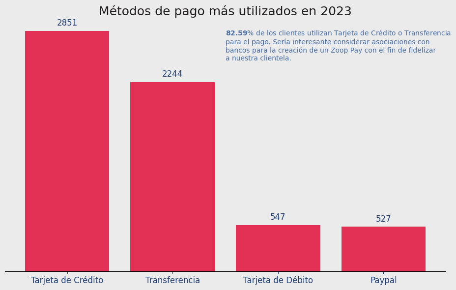
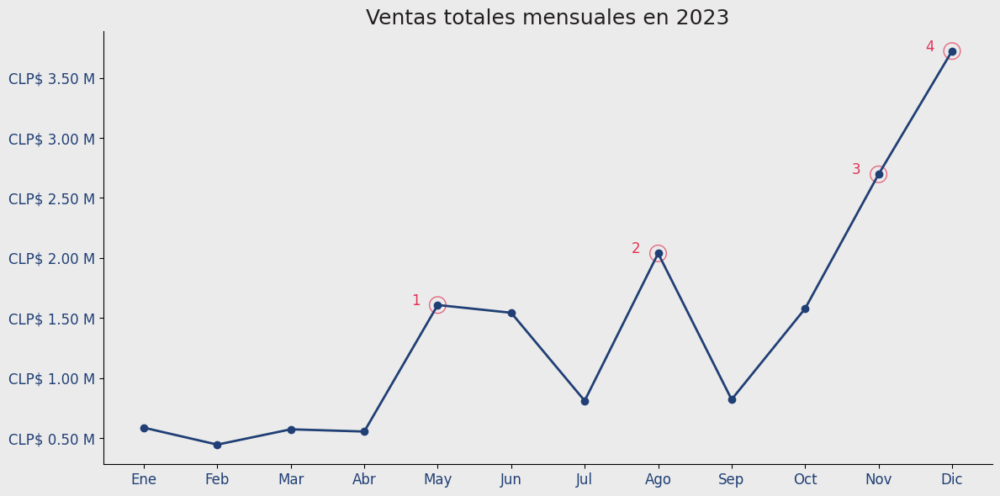
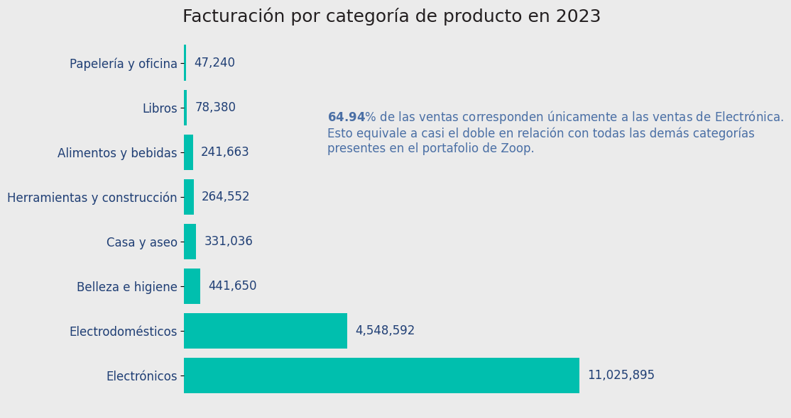
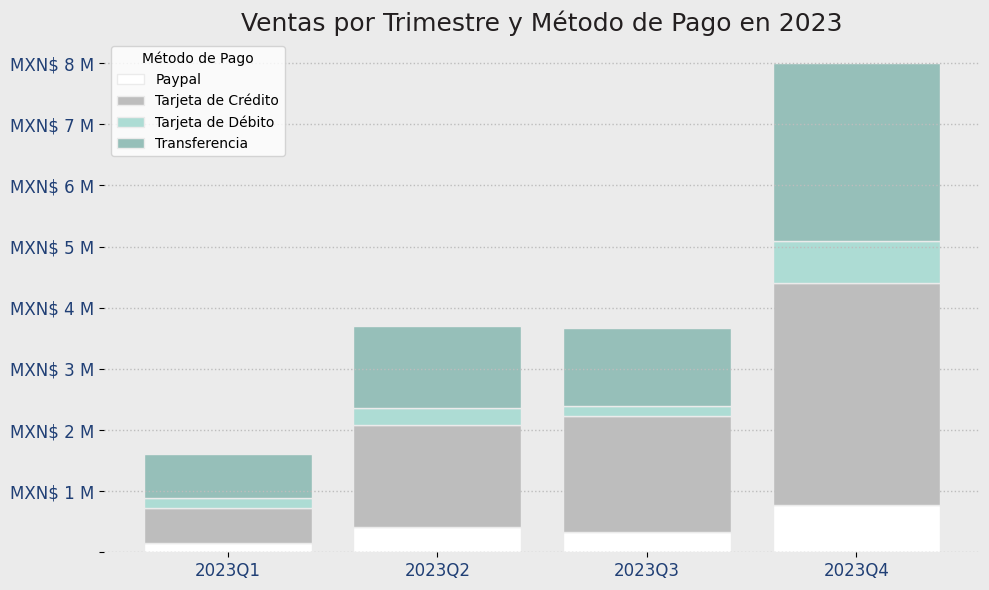
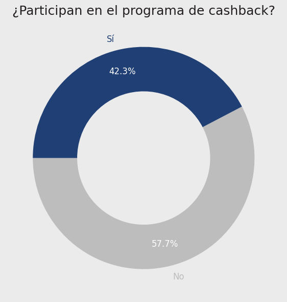
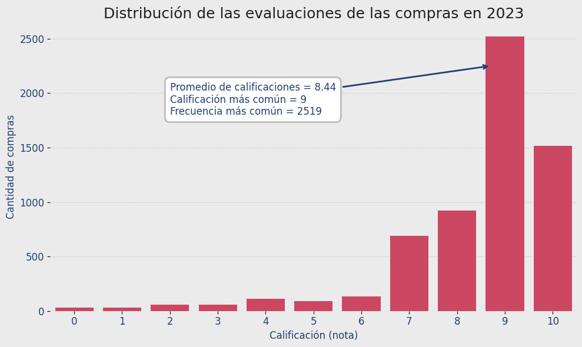
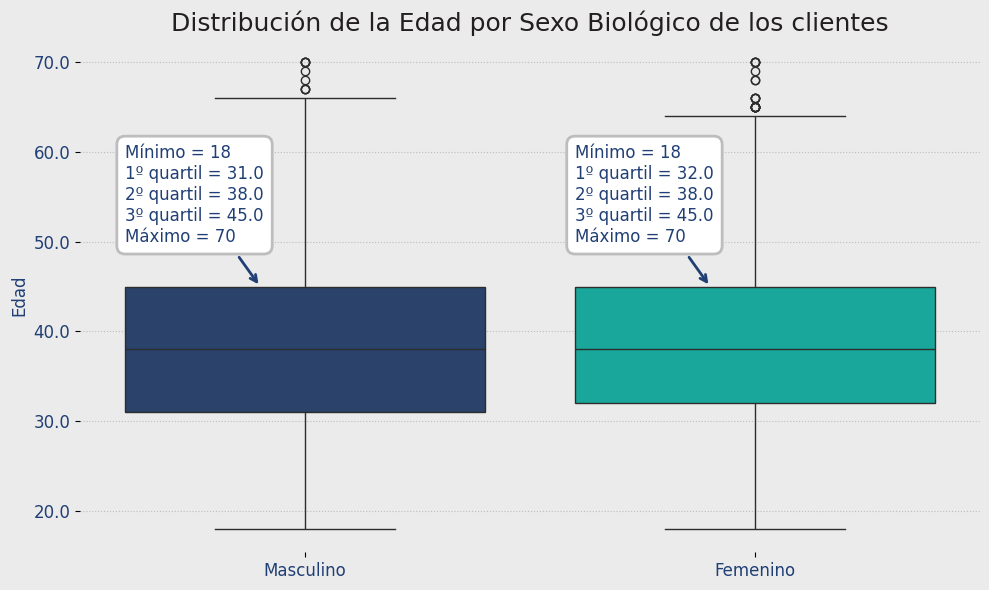

# **Informe de Ventas y Perfil de los Clientes de Zoop en 2023**

---

**Autor:** Omar BetoRock Toledo  
**Fecha:** 13 de junio de 2025  
**Empresa:** Zoop  
**Curso:** IA aplicada a la Ciencia de Datos

---

\newpage

# Resumen Ejecutivo

Este informe presenta un análisis integral de las ventas y el perfil de los clientes de Zoop durante el año 2023. Se utilizaron visualizaciones refinadas siguiendo la identidad visual de la marca, priorizando la accesibilidad y la estética visual. Cada sección destaca fortalezas, falencias y oportunidades de mejora para la toma de decisiones estratégicas.

\newpage

# 1. Métodos de pago más utilizados

**Fortalezas:**
- Alta preferencia por Tarjeta de Crédito y Transferencia, lo que facilita la gestión de pagos y reduce riesgos de impago.
- La concentración en pocos métodos permite negociar mejores condiciones con bancos y proveedores de servicios de pago.

**Falencias:**
- Baja diversidad en los métodos de pago puede limitar el acceso de algunos clientes.
- Métodos alternativos como billeteras digitales o pagos en efectivo tienen poca adopción.

**Mejoras:**
- Explorar alianzas con bancos para programas de fidelización.
- Promover métodos alternativos para captar nuevos segmentos de clientes.

|  |
|:--:|
| **Hallazgo:** La mayoría de los clientes utilizan Tarjeta de Crédito o Transferencia para el pago. Se recomienda explorar alianzas con bancos para fidelizar a la clientela. |

\newpage

# 2. Ventas totales mensuales

**Fortalezas:**
- Identificación clara de la estacionalidad y picos de ventas.
- Permite planificar inventario y campañas de marketing en los meses de mayor demanda.

**Falencias:**
- Meses con ventas bajas pueden indicar falta de campañas o baja demanda.
- No se visualizan causas de los picos o caídas.

**Mejoras:**
- Analizar campañas y eventos asociados a los picos.
- Implementar promociones en meses de baja venta para equilibrar el flujo de ingresos.

|  |
|:--:|
| **Hallazgo:** Se observa una variación estacional en las ventas, con picos en determinados meses que pueden estar asociados a campañas o eventos especiales. |

\newpage

# 3. Facturación por categoría de producto

**Fortalezas:**
- Electrónica lidera la facturación, mostrando un segmento fuerte y rentable.
- Permite identificar categorías con potencial de crecimiento.

**Falencias:**
- Dependencia excesiva de una sola categoría puede ser riesgosa.
- Otras categorías tienen baja participación.

**Mejoras:**
- Diversificar la oferta y fortalecer categorías menos vendidas.
- Analizar causas de bajo rendimiento en ciertas categorías.

|  |
|:--:|
| **Hallazgo:** La categoría Electrónica representa el mayor porcentaje de facturación, casi el doble que el resto de categorías. |

\newpage

# 4. Ventas por trimestre y método de pago

**Fortalezas:**
- Permite ver tendencias y cambios en la preferencia de métodos de pago a lo largo del año.
- Útil para ajustar estrategias comerciales por temporada.

**Falencias:**
- Si un método de pago cae en un trimestre, puede afectar la facturación.
- No se visualizan razones de los cambios de preferencia.

**Mejoras:**
- Realizar encuestas para entender cambios en preferencias.
- Ajustar promociones según el método de pago más popular en cada trimestre.

|  |
|:--:|
| **Hallazgo:** Se identifican tendencias en los métodos de pago preferidos por trimestre, lo que puede orientar estrategias comerciales. |

\newpage

# 5. Proporción de usuarios en el programa de cashback

**Fortalezas:**
- Buena adopción del programa de cashback, lo que puede aumentar la retención.
- Incentiva compras repetidas.

**Falencias:**
- Si la proporción de usuarios fuera baja, el programa no estaría cumpliendo su objetivo.
- No se mide el impacto real en la frecuencia de compra.

**Mejoras:**
- Medir el impacto del cashback en la recurrencia de compra.
- Promocionar el programa entre quienes aún no participan.

|  |
|:--:|
| **Hallazgo:** Un porcentaje relevante de clientes participa en el programa de cashback, lo que puede ser aprovechado para aumentar la retención. |

\newpage

# 6. Distribución de las evaluaciones de compra

**Fortalezas:**
- Promedio de calificaciones alto, lo que indica buena satisfacción.
- Baja frecuencia de calificaciones negativas.

**Falencias:**
- No se detallan motivos de las calificaciones bajas.
- Puede haber sesgo si solo algunos clientes califican.

**Mejoras:**
- Implementar encuestas de satisfacción más detalladas.
- Incentivar a más clientes a dejar su evaluación.

|  |
|:--:|
| **Hallazgo:** La mayoría de las evaluaciones son positivas, con un promedio alto y baja frecuencia de calificaciones negativas. |

\newpage

# 7. Distribución de la edad por sexo biológico

**Fortalezas:**
- Permite segmentar campañas y productos según perfil demográfico.
- Identifica grupos etarios predominantes por sexo biológico.

**Falencias:**
- Puede haber subrepresentación de ciertos grupos.
- No se cruza con otros datos relevantes (por ejemplo, ticket promedio por edad).

**Mejoras:**
- Cruzar edad y sexo con otras variables de interés.
- Personalizar campañas según los grupos más relevantes.

|  |
|:--:|
| **Hallazgo:** El perfil de edad varía según el sexo biológico, lo que puede ser útil para segmentar campañas y productos. |

\newpage

# Conclusión

El análisis realizado permite identificar oportunidades de mejora y estrategias para aumentar la satisfacción y fidelización de los clientes de Zoop, así como optimizar las ventas en función de los perfiles y preferencias detectados.
